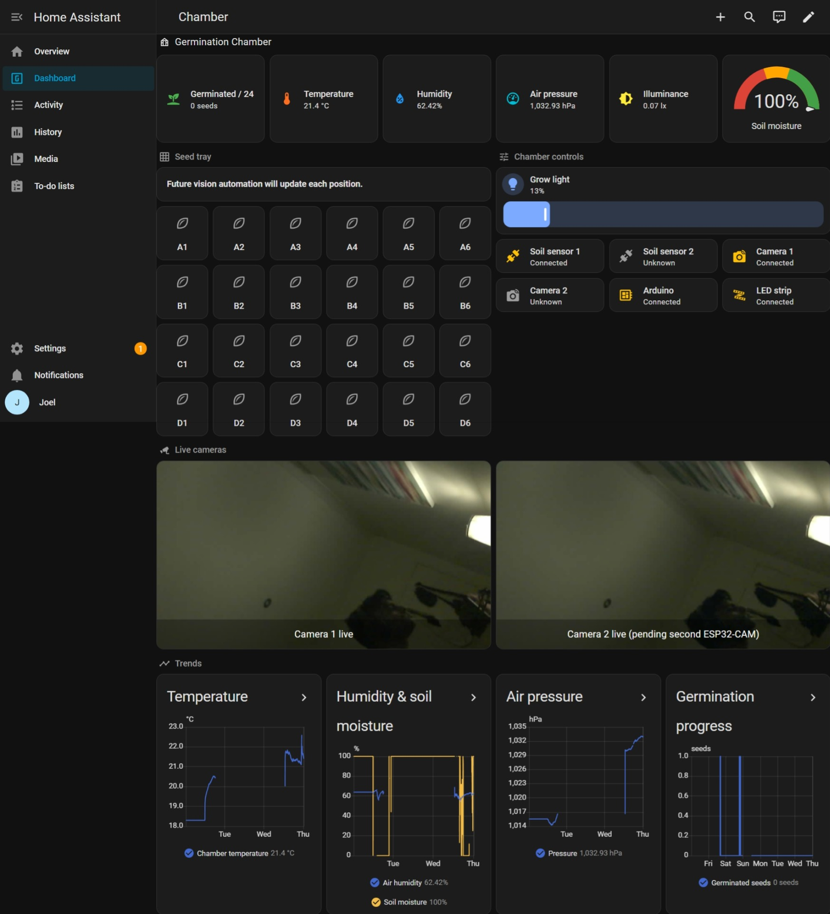
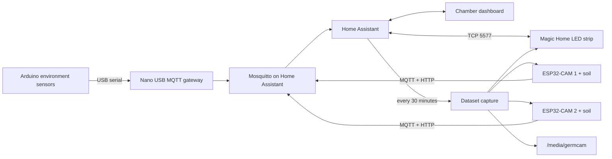

# Mini Germination Chamber

A Home Assistant-based chamber for monitoring a 4 x 6 seed tray, controlling
its grow light, and collecting images with matching environmental data.



## Overview

The chamber combines:

- a Raspberry Pi running Home Assistant and Mosquitto;
- an Arduino Nano 33 BLE Sense Rev2 measuring temperature, humidity, pressure,
  and light;
- up to two ESP32-CAM nodes, each publishing camera and soil-moisture data;
- a locally controlled Magic Home/LEDnet RGB strip; and
- a Home Assistant dashboard for live readings, equipment state, cameras,
  light control, trends, and 24 seed positions.

Every 30 minutes, Home Assistant captures an image from each available camera
and saves it with the corresponding soil, environment, camera, and light
metadata. This dataset is intended to support future germination-detection
work.

## Architecture



### Arduino

The Nano samples its onboard HS3003, LPS22H, and APDS9960 sensors every
30 seconds. It sends one serial record over `/dev/ttyACM0`. The local
`Nano USB Sensor Gateway` Home Assistant app converts that record to retained
MQTT state and publishes Home Assistant discovery entities.

Main topics:

```text
germination/nano33-environment/state
germination/nano33-environment/availability
```

USB and MQTT availability handling ensures stale readings become unavailable
when the Arduino disconnects. Illuminance is an estimate and should be
calibrated against a reference meter after the sensor is mounted.

### ESP32 cameras and soil sensors

Each ESP32 publishes beneath its node name:

```text
germination/germcam-1/availability
germination/germcam-1/status
germination/germcam-1/jpg_url
germination/germcam-1/stream_url
germination/germcam-1/soil_raw
germination/germcam-1/soil_moisture_percent
```

The second node uses `germcam-2`. Home Assistant packages expose each camera
and soil sensor as a separate device.

ESP32 firmware and real credentials are not tracked here. Use
[`germcam.example.cfg`](germcam.example.cfg) as the SD-card configuration
template. Soil percentages depend on correctly measured dry and wet raw values.

### LED strip

Home Assistant controls the strip locally through its Magic Home integration:

```text
light.germination_chamber_germination_chamber_light
```

The controller was last configured at `10.21.225.29:5577`. Its address is
assigned by DHCP, so a reservation is recommended. For reproducible
experiments, use fixed RGB, brightness, distance, and lighting duration. The
brightness setting is not a lux or PAR measurement.

## Dashboard and seed tracking

The dashboard uses only standard Home Assistant cards. It contains:

- current temperature, humidity, pressure, illuminance, and soil moisture;
- grow-light controls and device connectivity indicators;
- two camera panels;
- 72-hour environmental trends;
- a seven-day germination-count graph; and
- 24 persistent seed helpers, from `input_boolean.seed_a1` to
  `input_boolean.seed_d6`.

The seed tiles are read-only. Germination should be latched on by automation
and never automatically reversed. Reset the helpers only when starting a new
batch.

The included vision automation is an example only. It expects high-confidence,
repeated detections on `germination/vision/detections`; no production vision
service is currently included.

## Dataset automation

[`germcam_dataset_capture.yaml`](germcam_dataset_capture.yaml) runs at minutes
`00` and `30`. Its `shell_command.capture_germcam_dataset` action calls
[`config/scripts/run_germcam_capture.sh`](config/scripts/run_germcam_capture.sh),
which starts [`capture_germcam_dataset.py`](capture_germcam_dataset.py) for
`germcam-1` and `germcam-2`.

The ESP32 devices publish independently, typically much more often than the
dataset schedule. Home Assistant does not trigger their MQTT publications; it
only schedules the separate collection process.

| Local file | Home Assistant destination | Purpose |
| --- | --- | --- |
| `germcam_dataset_capture.yaml` | `/config/packages/` | Automation and shell command |
| `capture_germcam_dataset.py` | `/config/` | Image and metadata collector |
| `config/scripts/run_germcam_capture.sh` | `/config/scripts/` | Credential loader, logging, and command wrapper |

For each run, the capture script:

1. reads the latest retained Arduino environment state;
2. collects the latest MQTT values for each ESP32 node;
3. downloads each available JPEG;
4. queries the LED controller's current state; and
5. stores the image and a matching JSON Lines metadata record.

```text
/media/germcam/
|-- capture.log
|-- germcam-1/
|   |-- images/*.jpg
|   `-- metadata.jsonl
`-- germcam-2/
    |-- images/*.jpg
    `-- metadata.jsonl
```

Metadata includes the capture timestamp, image path and size, soil raw value,
soil-moisture percentage, temperature, humidity, pressure, illuminance, RSSI,
uptime, free heap, camera/configuration state, source MQTT messages, and parsed
plus raw LED status.

The wrapper reads MQTT credentials from the untracked file
`/config/secrets/germcam_capture.env` and uses `--allow-partial`, so a run
succeeds when at least one camera is captured.

Missing Arduino data produces a warning and empty environment fields. A camera
without a usable JPEG is recorded as a node failure; it only fails the overall
run when no requested camera succeeds.

At the last documented check, Germcam 1 captured successfully. Germcam 2 had
not supplied the expected JPEG URL, which is why partial capture remains
enabled.

## Repository layout

| Path | Contents |
| --- | --- |
| [`arduino/`](arduino/) | Nano firmware and USB-to-MQTT Home Assistant app |
| [`esp32/`](esp32/) | Home Assistant MQTT packages for the cameras and soil sensors |
| [`led_strip/`](led_strip/) | LED provisioning, discovery, and direct-control tools |
| [`dashboard/`](dashboard/) | Chamber package, dashboard YAML, and vision example |
| [`config/scripts/`](config/scripts/) | Scheduled-capture shell wrapper |
| [`capture_germcam_dataset.py`](capture_germcam_dataset.py) | Image and metadata collector |

Detailed component instructions remain in:

- [Arduino and Home Assistant setup](arduino/ARDUINO_HOME_ASSISTANT_SETUP.md)
- [ESP32 camera and soil setup](esp32/ESP32_GERMCAM_SETUP.md)
- [LED strip setup](led_strip/LED_STRIP_SETUP.md)
- [Dashboard setup](dashboard/GERMINATION_CHAMBER_DASHBOARD.md)

## Deployment summary

Home Assistant loads the project YAML through packages:

```yaml
homeassistant:
  packages: !include_dir_named packages
```

Deploy the camera, soil, chamber, and capture configuration to their Home
Assistant destinations:

```powershell
scp .\esp32\packages\esp32_camera_1.yaml ha:/config/packages/
scp .\esp32\packages\esp32_camera_2.yaml ha:/config/packages/
scp .\esp32\packages\esp32_soil_sensor_1.yaml ha:/config/packages/
scp .\esp32\packages\esp32_soil_sensor_2.yaml ha:/config/packages/
scp .\dashboard\germination_chamber.yaml ha:/config/packages/
scp .\germcam_dataset_capture.yaml ha:/config/packages/
scp .\capture_germcam_dataset.py ha:/config/
scp .\config\scripts\run_germcam_capture.sh ha:/config/scripts/
```

Always validate before restarting:

```powershell
ssh ha "ha core check"
ssh ha "ha core restart"
```

The Chamber dashboard is storage-managed. Paste
[`dashboard/chamber_dashboard.yaml`](dashboard/chamber_dashboard.yaml) into
the dashboard's Raw configuration editor rather than editing `.storage`.

Useful checks:

```powershell
ssh ha "ha apps logs local_nano_serial_mqtt"
ssh ha "/bin/sh /config/scripts/run_germcam_capture.sh"
ssh ha "tail -n 100 /media/germcam/capture.log"
ssh ha "tail -n 1 /media/germcam/germcam-1/metadata.jsonl"
ssh ha "python3 -m py_compile /config/capture_germcam_dataset.py"
ssh ha "ha addons logs core_mosquitto"
```

## Current status

At the last documented inspection on 15 July 2026:

- Home Assistant accepted the deployed configuration.
- The Arduino gateway was publishing environment readings.
- Germcam 1 and the LED strip were working.
- Germcam 2's configuration existed, but its live JPEG capture was pending.
- The 30-minute dataset automation was active.
- The dashboard and 24 seed helpers were deployed.
- Automatic vision-based germination detection was not yet implemented.

There are currently no checked-in irrigation, fan, heater, humidity-control,
or grow-light schedule automations.
